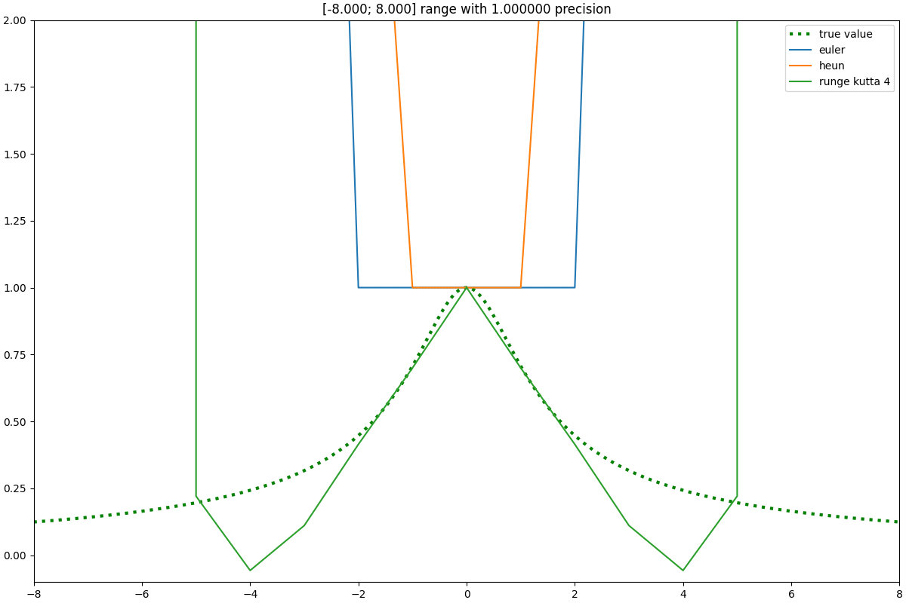
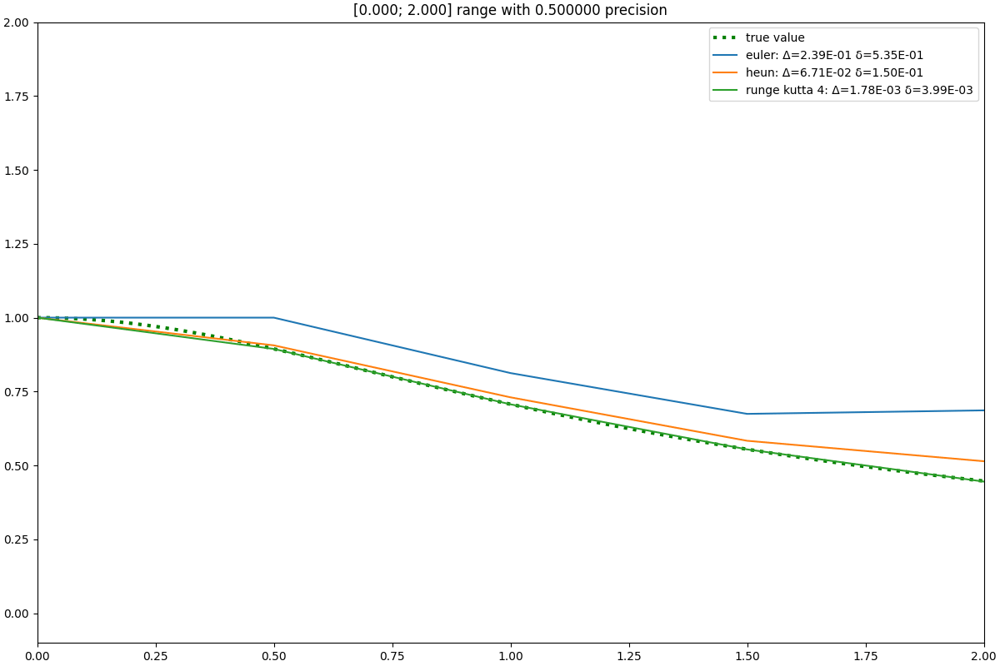

# Лабораторная работа №1.

Численное решение задачи Коши для уравнения первого порядка.

Уравнение: $y' = x^3 y^3 - xy$ при начальном условии $y(0) = 1$.

Полная (технически корректная) версия находится в [этом репозитории на Github](https://github.com/FB1-ITMO-CT/sem03-diff-eq-lab-001).

Автор: Бородулин Фёдор, M3238

## Аналитическое решение

### Заметим уравнение Бернулли

Уравнение равно $y' + P(x)y = Q(x)y^n$ при $P(x) = x$, $Q(x) = x^3$, $n = 3$.
Замена:  $z = y^{1-n} = y^{-2} \Rightarrow z' = -2 y^{-3} y'$

Умножим исходное уравнение на $-2 y^{-3}$: $-2 y^{-3} y' = -2x^3 + 2x y^{-2}$
При $z = y^{-2}$ и $z' = -2 y^{-3} y'$, получаем: $z' = -2x^3 + 2x z \Rightarrow z' - 2x z = -2x^3$

### Решаем линейное уравнение

Интегрирующий множитель $\mu(x) = e^{\int (-2x) dx} = e^{-x^2}$:  $(e^{-x^2} z)' = -2x^3 e^{-x^2} \Rightarrow e^{-x^2} z = \int -2x^3 e^{-x^2} dx$

Замена $t = x^2$ и $dt = 2x dx$: $\int -2x^3 e^{-x^2} dx = \int -x^2 \cdot 2x e^{-x^2} dx = -\int t e^{-t} dt$
$\int t e^{-t} dt = -t e^{-t} - e^{-t} + C \Rightarrow -\int t e^{-t} dt = t e^{-t} + e^{-t} + C = (x^2 + 1) e^{-x^2} + C \Rightarrow e^{-x^2} z = (x^2 + 1) e^{-x^2} + C \Rightarrow z = x^2 + 1 + C e^{x^2}$

### Подставляем замены обратно

$z = y^{-2}$: $y^{-2} = x^2 + 1 + C e^{x^2}$  

При $y(0) = 1$ получается: $1 = 0 + 1 + C \cdot 1 \Rightarrow C = 0$ (как удобно)

**Итого**: $y(x) = \dfrac{1}{\sqrt{x^2 + 1}}$, $x \in \mathbb{R}$.

Проверяем: $y'(x) = \dfrac{-x}{(x^2 + 1)^{3/2}}$. $x^3 y^3 - xy = \dfrac{x^3}{(x^2 + 1)^{3/2}} - \dfrac{x}{\sqrt{x^2 + 1}} = \dfrac{x^3}{(x^2 + 1)^{3/2}} - \dfrac{x (x^2 + 1)}{(x^2 + 1)^{3/2}} = \dfrac{-x}{(x^2 + 1)^{3/2}}$.
Сошлось 🎉 

## Графики

Оба изображения — GIF, пробегающие по разной точности симуляции.

### Простой результат

Заметно, что при накоплении отклонения от истинного решения все методы резко "убегают" на $+\inf$ или в $0$.

### С погрешностью, на разумном диапазоне

Здесь был взят малый отрезок графика для исключения влияния специфики функции. Легко заметить, что в таком сценарии точность методов соответствует ожиданиям.

Особенно легко наблюдаемо, что в случае же сдвига в сторону $+y$ функция начинает расти со скоростью $>x^3$, из-за чего методы более высоких порядков, которые точнее следуют данному поведению, оказываются менее точны по чистой метрике. Можно сказать, что истинное решение является областью нестабильного равновесия.

## Программная часть

### Исходный код

Файлы исходного кода на языке Python находятся в директории `./src`.

### Сборка и запуск проекта

Для работы с зависимостями используется инструмент [uv](https://github.com/astral-sh/uv):

- Создайте виртуальное окружение Python с необходимой для проекта версией интерпретатора 3.14: `uv venv --python 3.14 .venv`.

- Включите созданное окружение `./.venv/Scripts/activate` и синхронизируйте зависимости `uv sync --active`.

- Теперь доступен CLI интерфейс проекта `run`, вызывающий функцию `src.main:main`.
  Можно запустить `run --help` для получения справки по аргументам командной строки.

## Лицензия :)

Copyright 2025 Borodulin Fedor

Licensed under the Apache License, Version 2.0 (the "License");
you may not use this file, this project source code and examples except
in compliance with the License. You may obtain a copy of the License at

    http://www.apache.org/licenses/LICENSE-2.0

Unless required by applicable law or agreed to in writing, software
distributed under the License is distributed on an "AS IS" BASIS,
WITHOUT WARRANTIES OR CONDITIONS OF ANY KIND, either express or implied.
See the License for the specific language governing permissions and
limitations under the License.

